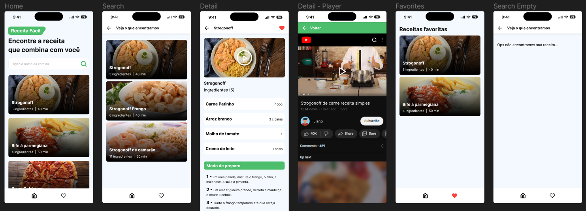

<h1 align="center"> APP RECEITA FÁCIL </h1>

O App Receita Fácil é um projeto com o intuito de praticar as tecnologias de front-end. O aplicativo possui as opões de busca, detalhes e favoritar receitas.  

  <a href="#-tecnologias">Tecnologias</a>&nbsp;&nbsp;&nbsp;|&nbsp;&nbsp;&nbsp;
  <a href="#-projeto">Projeto</a>&nbsp;&nbsp;&nbsp;|&nbsp;&nbsp;&nbsp;
  <a href="#-layout">Links</a>&nbsp;&nbsp;&nbsp;|&nbsp;&nbsp;&nbsp;
  <a href="#-layout">Layout</a>&nbsp;&nbsp;&nbsp;&nbsp;&nbsp;&nbsp;

  

 

  

## 🚀 Tecnologias

Esse projeto foi desenvolvido com as seguintes tecnologias:

- HTML e CSS
- JavaScript
- NodeJS
- Json-Server
- Android Studio
- React Native
- Git e Github
- Figma

## 💻 Projeto

O Receita Fácil é um aplicativo de busca de receitas, onde é possível encontrar os detalhes, modo de preparo e vídeo do preparo. Além disso, você pode favoritar as melhores receitas.
Para dar o início a aplicação é necessário ter instalado o NodeJS e o Android Studio, porém, é possível emular o projeto na web.  
A princípio, para criar o projeto, deve-se usar o comando `npx create-expo-app + nome` no seu terminal, buscar a basta onde foi criado e em seguida inicializar com `npx expo start`. 
Ao longo do desenvolvimento será preciso pesquisar a documentação para a instalação de algumas bibliotecas, como por exemplo o servidor `json-server`. que auxiliarão na criação de componentes e conexão com API.

## Links

- Instalação do [NodeJS](https://nodejs.org/en)
- Instalação do [Android Studio](https://developer.android.com/studio)
- Documentação do [expo](https://docs.expo.dev/)
- Documentação do [React Navigation](https://reactnavigation.org/)
- Documentação do [json-server](https://www.npmjs.com/package/json-server)

## 🔖 Layout

Você pode visualizar o layout do projeto através [desse link](https://www.figma.com/file/U5FIz9fg1qPzjNXti1oXag/App-Receita-F%C3%A1cil?node-id=0-1&t=MMM02i5ThwJJaNj1-0). É necessário ter conta no [Figma](https://figma.com) para acessá-lo.
